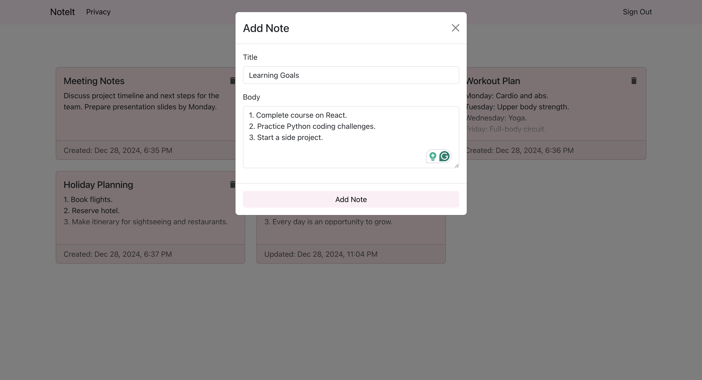

# NoteIt

A full-stack web application for creating and managing personal notes, built with the MERN stack (MongoDB, Express, React, Node.js) and TypeScript.



## Features

-   🔐 User authentication with secure sessions
-   📝 Create, read, update, and delete notes
-   🎨 Clean and responsive UI using Bootstrap
-   🔒 Protected routes and API endpoints
-   ⚡ Real-time updates
-   🌐 Client-side routing
-   🛡️ Type safety with TypeScript

## Tech Stack

### Frontend

-   React
-   TypeScript
-   React Bootstrap for UI components
-   React Hook Form for form handling
-   CSS Modules for styling

### Backend

-   Node.js
-   Express.js
-   TypeScript
-   MongoDB with Mongoose
-   express-session for authentication
-   bcrypt for password hashing
-   envalid for environment validation

## Getting Started

### Prerequisites

-   Node.js (v14 or higher)
-   MongoDB Atlas account
-   npm or yarn

### Installation

1. Clone the repository

    ```bash
    git clone https://github.com/claudiaaziz/NoteIt.git
    cd NoteIt
    ```

2. Install dependencies for both frontend and backend

    ```bash
    # Install backend dependencies
    cd backend
    npm install

    # Install frontend dependencies
    cd ../frontend
    npm install
    ```

3. Create a `.env` file in the backend directory with the following variables:

    ```env
    MONGO_CONNECTION_STRING=your_mongodb_connection_string
    PORT=5000
    SESSION_SECRET=your_session_secret
    ```

4. Start the development servers

    In the backend directory:

    ```bash
    npm run dev
    ```

    In the frontend directory:

    ```bash
    npm start
    ```

    The app will be available at `http://localhost:3000`

## Features in Detail

### Authentication

-   User registration and login
-   Session-based authentication
-   Protected routes
-   Secure password hashing

### Notes Management

-   Create new notes
-   View all notes
-   Update existing notes
-   Delete notes
-   Notes are private to each user

### UI/UX

-   Responsive design
-   Loading states
-   Error handling
-   Form validation
-   Clean and intuitive interface

## API Endpoints

### Authentication

-   `POST /api/users/signup` - Register a new user
-   `POST /api/users/login` - Login user
-   `GET /api/users` - Get current user
-   `POST /api/users/logout` - Logout user

### Notes

-   `GET /api/notes` - Get all notes for current user
-   `POST /api/notes` - Create a new note
-   `GET /api/notes/:noteId` - Get a specific note
-   `PATCH /api/notes/:noteId` - Update a note
-   `DELETE /api/notes/:noteId` - Delete a note
